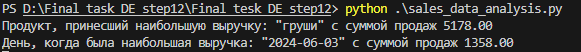
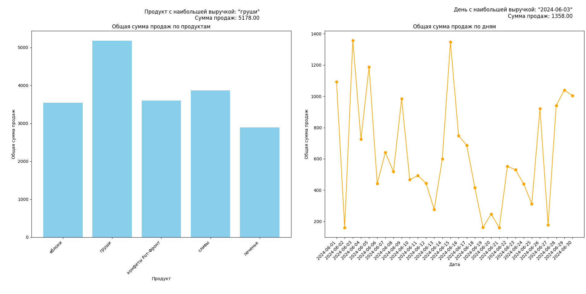

# Итоговое задание для курса Data Engineer с нуля до Junior

## Описание

Это решение итогового задания для курса **Data Engineer с нуля до Junior** в **step 12.9**.

## Содержание

1. **Описание проекта:**
   - Загрузка файла с расширением .csv с данными о продажах
   - Преоброзование .csv в список продаж 
   - Суммирование итоговых продаж по датам и по продуктом
   - Нахождение даты и товара с наибольшими продажами
   - Вывод информации и построение графиков продаж

2. **Функциональные возможности:**
   - Суммирование показателей продаж по дням и по товарам
   - Построение графиков продаж

3. **Инструкции по запуску:**
   - Установить при необходимости matplotlib.
   - Заупустить файл "sales_data_analysis.py".
   - "pip install matplotlib"
   - "python .\sales_data_analysis.py"

4. **Структура проекта:**
   - "README.md" - описание репозитория
   - "sales_data_analisys.py" - финальный файл проекта
   - "Final_task_DE_step12.ipynd" - предварительный файл работы. Функционально то же самое, что и "sales_data_analysis.py", но с функционалом генерации данных.
   - "generated_data.csv" - данные для анализа
import csv
import urllib.request
import io
import matplotlib.pyplot as plt
import random
from datetime import datetime, timedelta
import pandas as pd
5. **Требования:**
   - Для работы программы используются библиотеки python такие как: csv, urllib, io, matplotlib, datetime
   - Для работы в jupiter notebook также потребуются pandas, random

## Пример использования

